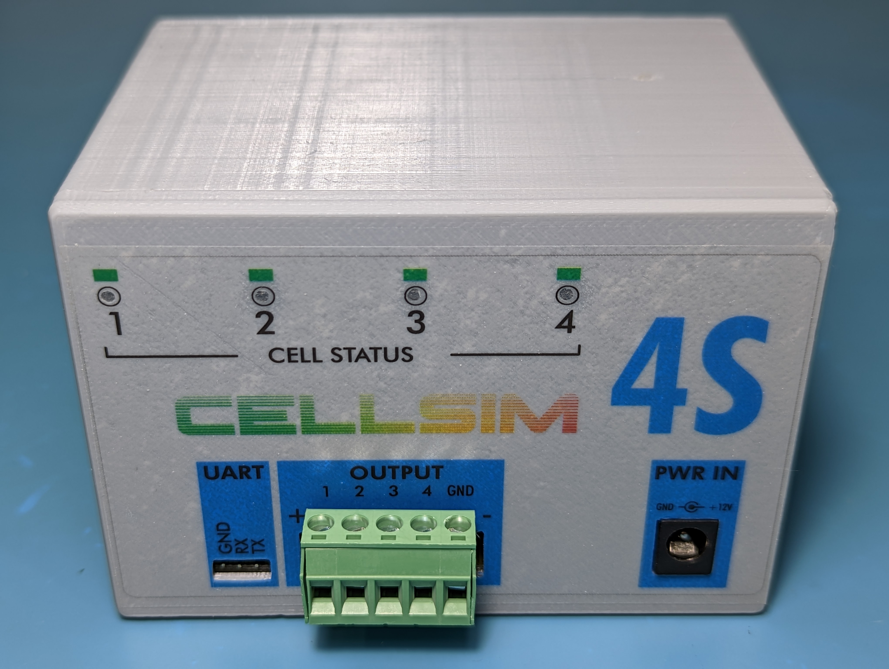
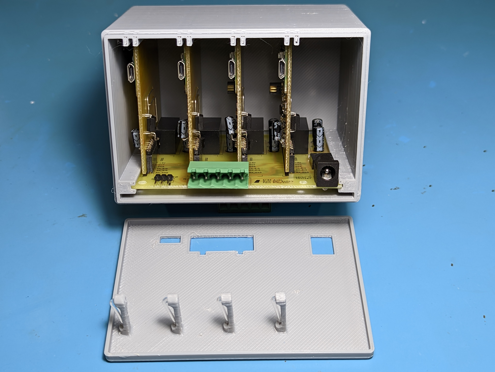
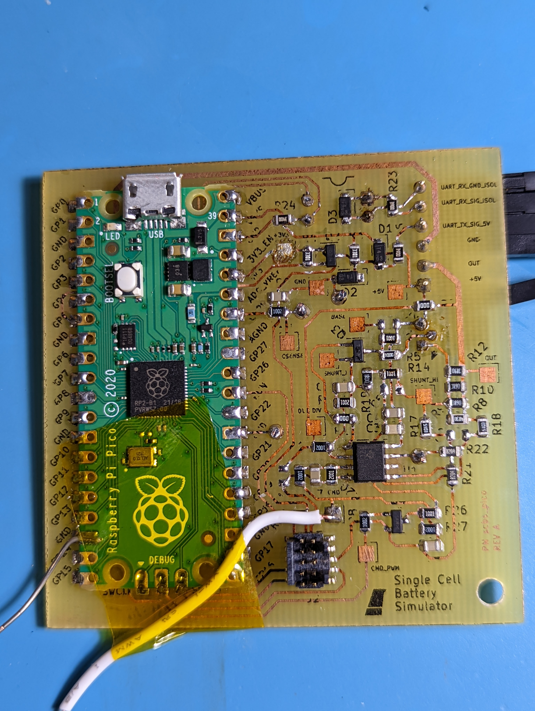
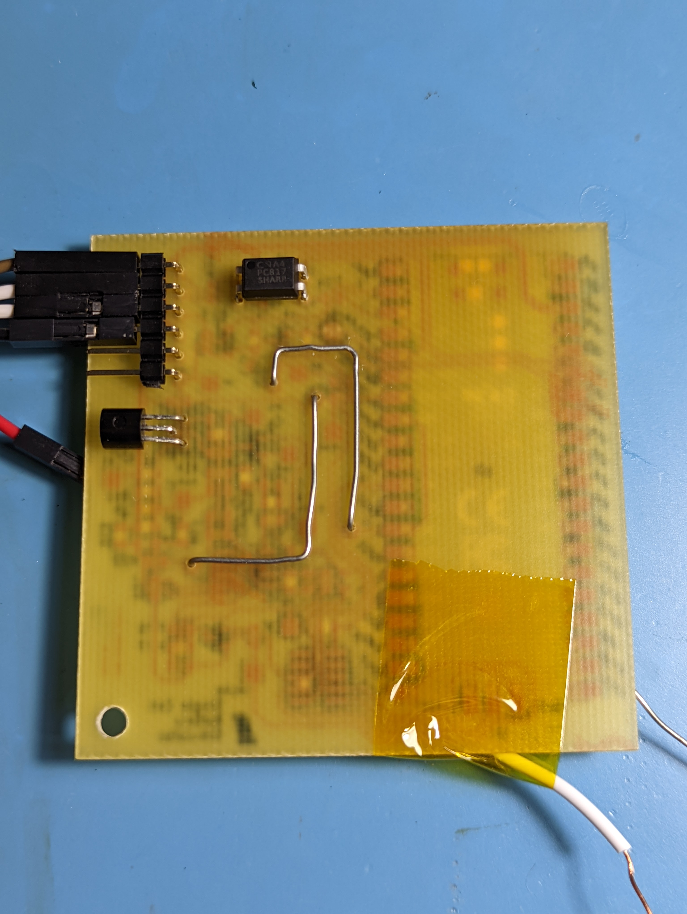

# scbs
Single Cell Battery Simulator for testing a BMS.

# CELLSIM 4S

Cellsim 4S is a low-current battery pack simulator that simulates four battery cells in series. Each cell has a settable output voltage between 2.5-4.5V and a readable output current. Communication is done over a 9600 baud UART link using a custom serial protocol.

[DATASHEET](word/datasheet_cellsim_4s-1.0.0.pdf)

# SCBS Pico

SCBS Pico is a single battery cell simulator that can be daisy chained with other devices of the same type in order to build a full simulated battery pack. It is the basic building block of the CELLSIM 4S.

[DATASHEET](word/datasheet_scbs_pico.pdf)

